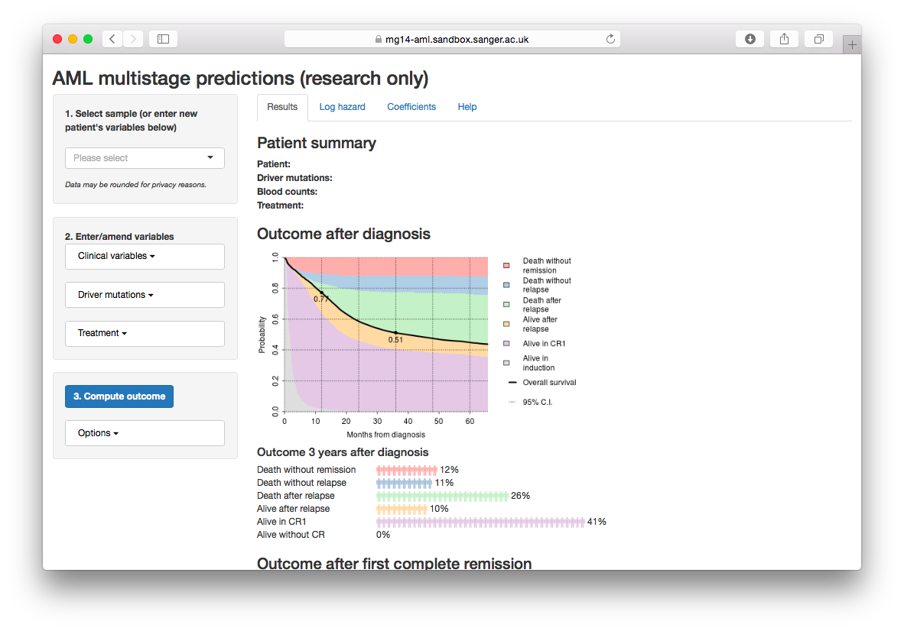
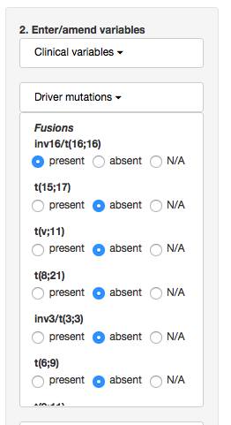
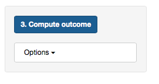
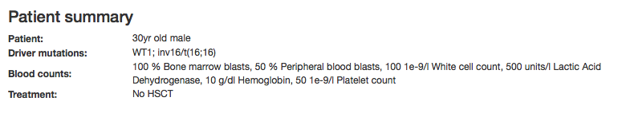

### Background

This webtool generates predictions according to the multistage random effects model presented in 
<a href="http://dx.doi.org/10.1038/ng.3756">M. Gerstung et al., Precision oncology for acute myeloid leukemia using a knowledge bank approach. Nature Genetics, 49:332-340, 2017</a>.

Using genomic and clinical variables, the tool models the transitions from **induction** to either:
 
   * **death without remission** (non-complete remission death, NCD) or 
   * **complete remission** (CR), and also the subsequent transitions to 
      * **death without relapse** (non-relapse death, NRD), 
      * **relapse** (Rel), as well as 
         * **post relapse deaths** (PRD).

Based on these rates the probability to be alive or die in either stage are computed for each patient, based on his individual genomic and clinical profile.

### Generating predictions

Initially, all values are blank and predictions are being made for a patient with all variables being average.
To generate multistage predictions for a patient with a specific constellation of risk factors, follow the following 3 steps:

#### 1. Preselect a patient form the sidebar

The menu contains data from 1,540 patients analysed in out study. Preselecting a patient will populate the menus with prognostic variables below. Selecting "Reset all variables"
will reset the selection. Note that you may also start from a reset stage.

#### 2. Enter/amend variables

Clicking on either of the three categories opens up dialogs to enter/amend different prognostic variables. Qualitative variables such as the presence/absence of driver
mutations are shown as radio buttons. Quantitative variables such as age can be entered numerically. A warning will be produced if the values are outside the range 
observed in the training cohort. 

#### 3. Compute

When you are finished with all variables, click the compute button to calculate outcome. Additional options regarding confidence intervals can be after clicking Options.

#### Notes
If you set a value to NA, or leave the field blank, the corresponding value will be **imputed** using the covariance with the other variables. 
This usually makes the prediction more similar
to the prediction for a hypothetical individual with all variables being average, and increases the confidence intervals due to the greater uncertainty. Note that 
the prediction for an average individual is very similar, but not 100% identical to the average of all predictions. 

### Main page

Results of the calculations are displayed on the main page. You can select from the following tabs:

* **Results** (default) shows the main results page discussed below.

* **Log hazard**  displays a table with the calculated log hazard of transition from one stage to the next, broken down into risk categories. Note that for CR, high
values denote a fast transition to CR, which is favourable, unlike the other, unfavourable transitions.

* **Coefficients**  shows a table with the coefficients for each _covariate_ X and transition. _Input_ shows the value entered (some are rescaled),  _Imputed_ contains the imputed value if the variable was missing.
The subsequent columns show the _coef_ficients beta and _values_ = X * beta for each variable and transitions. The latter denotes the contribution to the log hazard of each variable. 

* **Help** displays this help page.

By default the website shows the following results page.

### Results

This section shows a textual summary of the information that was entered. Missing variables will be omitted.

The first graph displays the time-dependent probability to be in each of the 6 possible states as a function of the months after diagnosis.
 Below you see a graphical 
representation of the probabilities of being in a particular state three years after diagnosis. Each 
symbol denotes 1/100 patients with the given risk factors.

The first graph displays the time-dependent probability to be in each of the 4 possible states as a function of the months after remission.
 Below you see a graphical 
representation of the probabilities of being in a particular state three years after remission. Each 
symbol denotes 1/100 patients with the given risk factors.
