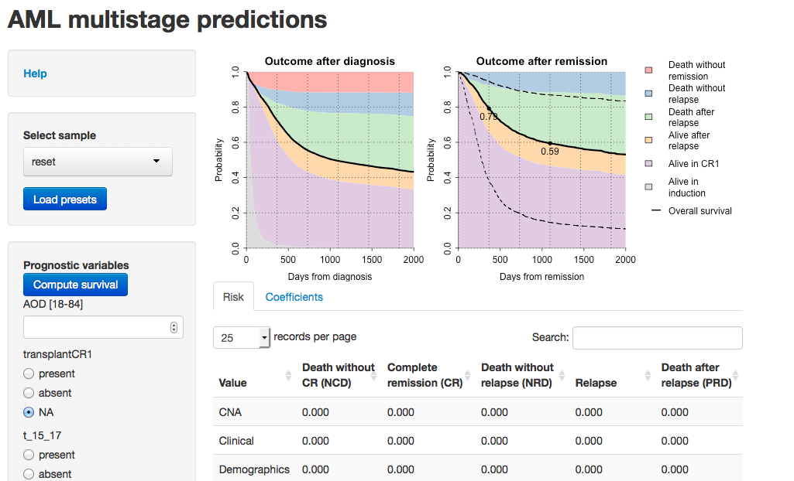

# AML multistage predictions

This webtool generates predictions according to the multistage random effects model presented in 
_Personally tailored cancer management based on knowledge banks of genomic and clinical data_ (Gerstung et al., submitted manuscript).

The tool model the transitions from _induction_ to either _death without remission_ (non-complete remission death, NCD) or _complete remission_ (CR), 
and also the subsequent transitions to _death without relapse_ (non-relapse death, NRD), _relapse_ (Rel), as well as _post relapse deaths_ (PRD).

Based on these rates the probability to be alive or dead in either of stage are computed for each patient.

### Sidebar
The left navigation panel has the following elements:

* **Help** Displays this page.
* **Select sample** You can select a sample from the drop down list to load the values of each his prognostic variables. Click **load presets** when done.
* **Prognostic variables** You may also manually enter the values of prognostic variables. For genomic lesions the choices are given by radio buttons. Other variables
are entered as a numeric value. The valid range is denoted by square brackets.
* **Confidence intervals**. You can choose between numerical and analytically computed confidence intervals. Currently latter only works for predictions after remission, but
is considerably faster.

If you set a value to NA, or leave the field blank, the corresponding value will be imputed using the covariance with the other variables. This makes the prediction more similar
to the prediction for a hypothetical individual with all variables being average. The prediction for an average patient is shown if you select 'reset' under **Select sample**. Note that 
the prediction for an average individual is very similar, but not 100% identical to the average of all predictions. 

After changing an input, please click **Compute survival** to update the predictions.

### Main panel
#### Top figures
The main panels display the time-dependent multistage probabilities as two sediment plots. The left is measured from diagnosis, the right shows the predictions after remission.

#### Tables
Two tables are shown underneath the figures: 

* The first displays the **risk** (log hazard) of transition from one stage to the next, broken down into risk categories. Note that for CR, high
values denote a fast transition to CR, which is favourable, unlike the other, unfavourable transitions.
* The second tab shows the **coefficients** for each _covariate_ X and transition. _Input_ shows the value entered (some are rescaled),  _Imputed_ contains the imputed value if the variable was missing.
The subsequent columns show the _coef_ficients beta and _values_ = X * beta for each variable and transitions. The latter denotes the contribution to the log hazard of each variable. 